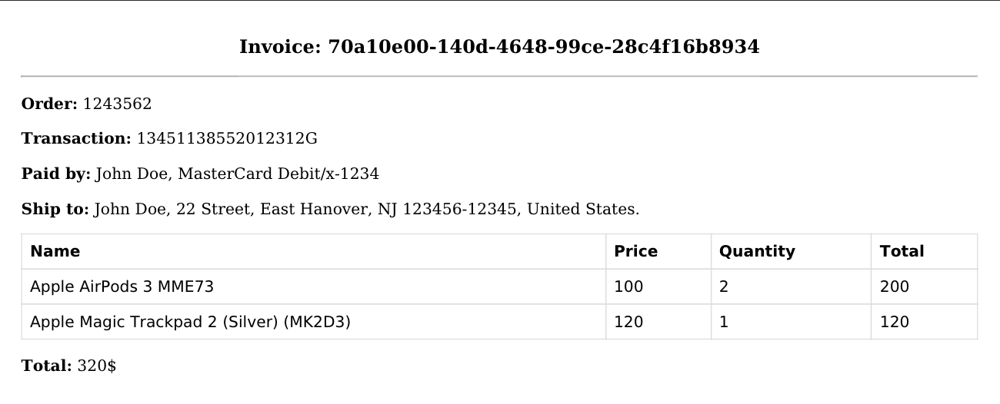

## Service for PDF files generation.

### Stack:

* [go-wkhtmltopdf](https://github.com/SebastiaanKlippert/go-wkhtmltopdf)
* [Fx](https://github.com/uber-go/fx)
* [Gin](https://github.com/gin-gonic/gin)
* [Swaggo](https://github.com/swaggo)

### For local development requires installed `wkhtmltopdf`:
* For macOS: ` brew install --cask wkhtmltopdf`
* For Ubuntu: `apt-get install -y wkhtmltopdf`

### Commands:

#### Generate OpenAPI spec:

````shell
swag init --parseDependency
````

#### Docker build

````shell
docker build -t pdf-generator:latest .
````

#### Docker run

````shell
docker run -d -t -i -p 8080:8080 --name pdf-generator pdf-generator:latest
````

### Generated file example:


### Request example
```shell
curl --location 'localhost:8080/invoices' \
--header 'Content-Type: application/json' \
--data '{
  "id": "70a10e00-140d-4648-99ce-28c4f16b8934",
  "orderId": "1243562",
  "transactionId": "13451138552012312G",
  "paid": {
    "name": "John Doe",
    "card": {
      "name": "MasterCard Debit",
      "number": "x-1234"
    }
  },
  "ship": {
    "name": "John Doe",
    "address": {
      "line1": "22 Street",
      "line2": "East Hanover, NJ 123456-12345",
      "country": "United States"
    }
  },
  "items": [
    {
      "name": "Apple AirPods 3 MME73",
      "price": 100.0,
      "quantity": 2,
      "total": 200.0
    },
    {
      "name": "Apple Magic Trackpad 2 (Silver) (MK2D3)",
      "price": 120.0,
      "quantity": 1,
      "total": 120.0
    }
  ],
  "totalAmount": 320.0,
  "currency": "$"
}'
```
